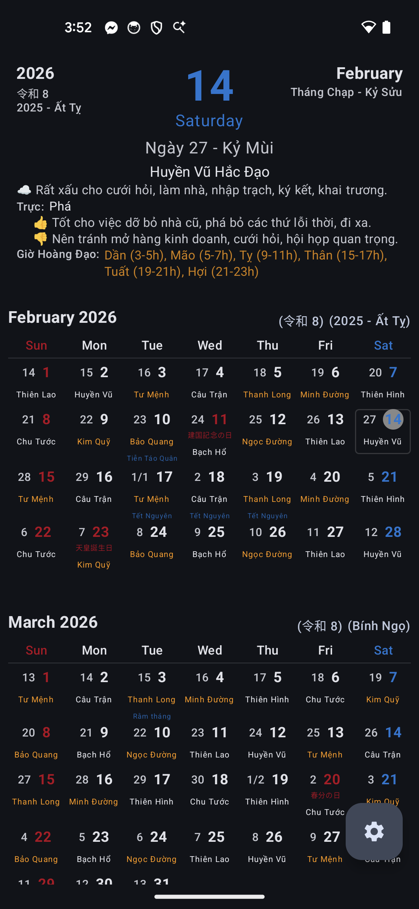
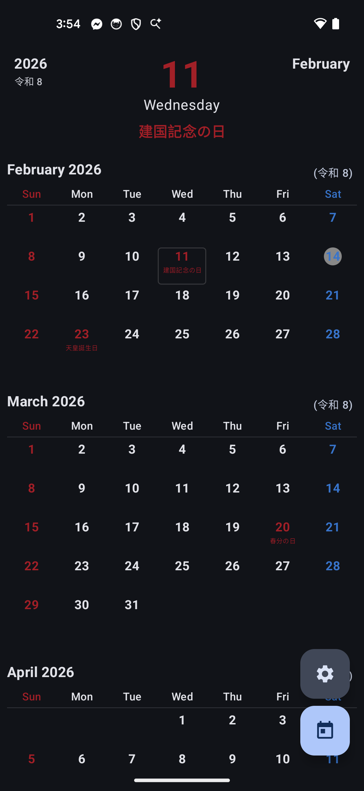
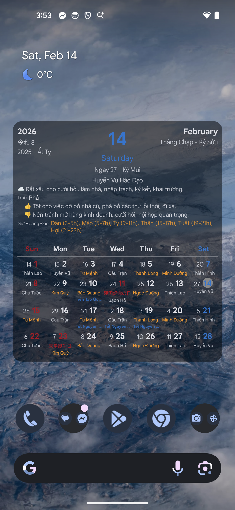
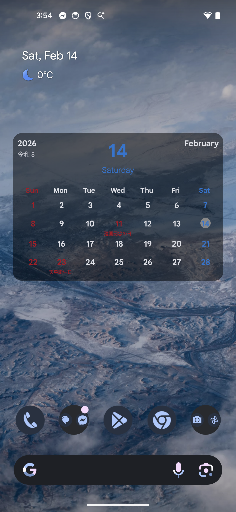

# 📅 Ja-Vi Calendar

---

## 🚀 Câu chuyện ra đời

Dự án này bắt nguồn từ một nhu cầu vô cùng cấp thiết:  
**👉 Tắt báo thức để ngủ nướng.**

Mình không tìm được ứng dụng nào hiển thị **ngày nghỉ lễ của Nhật một cách trực quan** – kiểu nhìn phát là biết hôm nay có cần dậy đi làm hay không.  
Đúng lúc chuẩn bị về Việt Nam chơi, lại không mang theo lịch giấy, thế là quyết định **tự làm một app “cây nhà lá vườn”** để phục vụ chính mình.

Đã làm app thì làm cho tới.  
Khi ghi giấy tờ hay làm thủ tục, mình hay bị khựng lại vì những câu hỏi quen thuộc:
- Năm nay là **Reiwa mấy**?
- Mình sinh năm nào theo lịch Nhật?

Thế là **thêm luôn phần năm Nhật (和暦)** cho đỡ phải tra Google mỗi lần.

Cuối cùng, để lịch Nhật không quá đơn điệu – và quan trọng hơn là để **biết chính xác khi nào tới Tết** – mình tích hợp thêm **Lịch Vạn Niên** cho đủ bộ.

---

## ✨ Tính năng chính

- 🔴 **Ngày lễ Nhật Bản – Đỏ là nghỉ**  
  Hiển thị nổi bật các ngày nghỉ lễ theo dữ liệu chính thức từ  
  👉 https://www8.cao.go.jp/chosei/shukujitsu/gaiyou.html

- 🔴 **Năm Nhật Bản (和暦)**  
  Biết ngay năm hiện tại theo lịch Nhật, không cần tra cứu linh tinh.

- 🧧 **Lịch Vạn Niên – Thuần Việt đính kèm**  
  Xem âm lịch, can chi, hoàng đạo / hắc đạo… để không bỏ lỡ cái Tết nào.

---

## 🛠 Tech Stack & “Đồng bọn”

Ứng dụng được hoàn thiện với sự hỗ trợ của một đội ngũ AI khá là… tiết kiệm:

- **Android Studio Agent**  
  Nhà nghèo mà lười gõ code, nên dùng `Gemini No-Cost Tier`.  
  Hơi vất vả chút nhưng viết app lúc rảnh, **miễn phí là chính nghĩa**.

  - Ban đầu có thử Antigravity nhưng **đụng limit quá nhanh**, đợi mệt nên thôi.

- **Gemini**  
  Cố vấn cấp cao: vừa cung cấp thông tin, vừa làm nhà văn khi cần!

---

*App được phát triển với mục tiêu cao cả là bảo vệ giấc ngủ của bản thân,  
nên phần viết test… xin phép để sau.* 😴

---

## 📸 Vài ảnh chụp màn hình
#### 📱 Giao diện ứng dụng
|                 Có lịch âm                 |                Không có lịch âm                 |               Cài đặt               |
|:------------------------------------------:|:-----------------------------------------------:|:-----------------------------------:|
|  |  |  |

#### 🏗 Widget màn hình chính
|                 Widget có lịch âm                  |                Widget chỉ có lịch Nhật                 |
|:--------------------------------------------------:|:------------------------------------------------------:|
|  |  |
